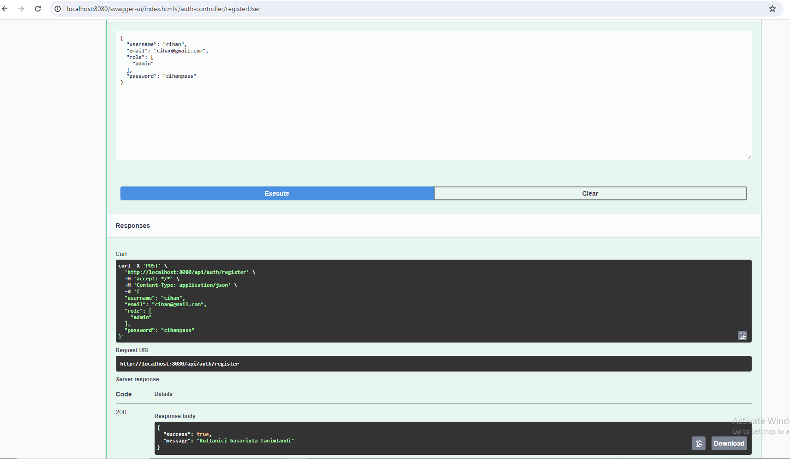

# Nocta Application
login-service assessment

swagger linki = http://localhost:8080/swagger-ui/index.html#/

Kullanılan Teknolojiler: 
-Spring Boot
-Spring Security
-Spring Boot Multi Module Structure
-Postgresql
-Spring Data Jpa

response mesajları için türkçe ve ingilizce dil desteğini sağlamak için internationalization modülünü yazdım.module olarak yazmamın sebebi farklı servisler içinde kullanabilmek için.
internationalization modülünü eklemek için resource bundle ları ekleyip @EnableInternalization u base classa eklemek

default dil tr olarak  setledim değiştirmek için alttaki değer en yapılabilir.

swagger içinde module yazdım. serviste kullanmak için @EnableSwagger eklemek yeterli

sistemi dockerda ayağa kaldırmak için mvn clean install yaptıktan sonra proje dizininde docker compose up komutunu koşmak yeterli

sistem kullanıcı rolü olarak admin ve user  rollerini desteklemekte alttaki init sql i program başlatılınca çalışacak

default değerlerle kullanıcı tanımlama

login olma 

admin tokenıyla admin kısımlarına erişme

database kısmında şifreler şifrelenmiş şekilde tutulur 

custom.app.locale=en olarak setlenirse

